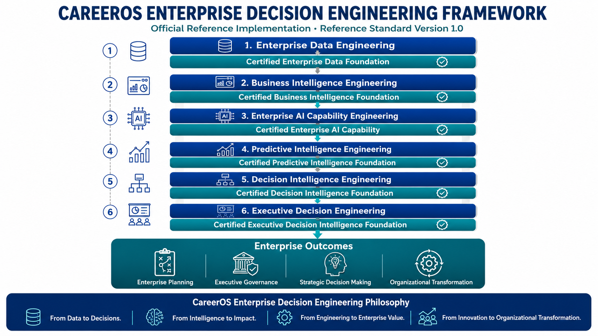

# CareerOS Enterprise Decision Engineering Framework (CEDEF)

## A New Enterprise Engineering Discipline for Transforming Enterprise Data into Trustworthy Executive Decision Intelligence

### Enterprise AI • Business Intelligence • Decision Intelligence • Executive Decision Support

**Official Framework Portal**

📘 Reference Standard Version 1.0

---

# Welcome to CEDEF

The **CareerOS Enterprise Decision Engineering Framework (CEDEF)** introduces a new enterprise engineering discipline dedicated to transforming enterprise intelligence into trustworthy, explainable, and actionable executive decision intelligence.

Rather than treating Enterprise Data Engineering, Business Intelligence, Artificial Intelligence, Predictive Intelligence, and Executive Decision Support as isolated technical capabilities, CEDEF integrates them into a governed enterprise engineering architecture focused on one objective:

> **Better organizational decisions.**

This repository serves as the official home of the framework, presenting its philosophy, architecture, signature innovations, publications, and enterprise reference implementations.

---

# Why CEDEF Exists

Organizations have never possessed greater volumes of enterprise data.

Business Intelligence, Artificial Intelligence, Machine Learning, and Predictive Analytics have dramatically improved the ability to generate enterprise insight.

Yet organizations continue to struggle with one enduring challenge.

> **How do we consistently transform enterprise intelligence into trustworthy executive decisions?**

Traditional analytics initiatives frequently conclude with dashboards, reports, predictive models, or AI solutions.

Enterprise Decision Engineering extends that lifecycle by engineering how enterprise intelligence becomes governed, explainable, accountable, and actionable executive decision intelligence.

---

# Enterprise Decision Engineering Architecture

### Signature Visual SV-002

**Enterprise Decision Engineering Architecture**

*Illustrates the six integrated enterprise capabilities that systematically transform enterprise intelligence into trustworthy executive decision-making.*

---

# What Makes CEDEF Different?

## 🏛 Enterprise Decision Engineering

Enterprise Decision Engineering extends enterprise intelligence beyond analytics by introducing a governed engineering discipline focused on decision quality rather than analytical output alone.

The destination is not more intelligence.

The destination is better organizational decisions.

---

## 🧠 Progressive Enterprise Asset Engineering

One of CEDEF's defining innovations is **Progressive Enterprise Asset Engineering**.

Every engineering initiative should produce governed, reusable enterprise assets that strengthen future organizational capability.

Projects conclude.

Enterprise capability should continue to grow.

---

## 🤖 Enterprise AI Capability Engineering

Artificial Intelligence should operate as a governed enterprise capability rather than an isolated technical implementation.

Within CEDEF, Enterprise AI is engineered to support explainability, governance, executive confidence, and measurable organizational value.

---

# Framework in Action

The CareerOS Enterprise Decision Engineering Framework is demonstrated through its official enterprise reference implementation.

## 🛍 Official Retail Decision Intelligence Reference Implementation

### AI-Driven Demand Forecasting & Inventory Optimization

Demonstrates:

- Enterprise Data Engineering
- Business Intelligence Engineering
- Enterprise AI Capability Engineering
- Predictive Intelligence Engineering
- Decision Intelligence Engineering
- Executive Decision Engineering

➡️ https://github.com/camunyah/ai-demand-forecasting-inventory-optimization

---

# Publications

The CareerOS Publications series introduces, explains, and progressively expands Enterprise Decision Engineering through executive publications, preview editions, and reference standards.

## 📄 Executive White Paper

**WP-001**

**Enterprise Decision Engineering**

*Why Enterprise Intelligence Needs an Engineering Discipline*

**Status:** ✅ Published

---

## 📘 Preview Edition

**PE-001**

**CareerOS Enterprise Decision Engineering Framework**

Preview Edition

**Status:** ✅ Published

---

## 📚 Reference Standard

**RS-001**

CareerOS Enterprise Decision Engineering Framework

**Status:** 🚧 In Development

---

## 📖 CareerOS Publications Repository

Explore the complete CareerOS publication library.

➡️ https://github.com/camunyah/careeros-publications

---

# CareerOS Vision

CareerOS is an enterprise engineering ecosystem dedicated to advancing Enterprise Decision Engineering through:

- Research
- Reference Standards
- Executive White Papers
- Enterprise Software
- Reference Implementations
- Executive Education
- Professional Consulting
- Certification

Its mission is to help organizations transform enterprise intelligence into trustworthy executive decision intelligence through disciplined enterprise engineering.

---

# CareerOS Ecosystem

The CareerOS ecosystem consists of four complementary repositories.

| Repository | Purpose |
|------------|---------|
| 🏠 **Executive Portal** | Meet the architect and explore the CareerOS vision |
| 📘 **Framework Portal** | Understand the CareerOS Enterprise Decision Engineering Framework |
| 🛍 **Reference Implementation Portal** | Experience Enterprise Decision Engineering in practice |
| 📄 **CareerOS Publications** | Executive White Papers, Preview Editions, and Reference Standards |

Together these repositories provide a complete enterprise engineering journey—from executive vision, to framework, to implementation, to a growing body of professional knowledge.

---

# Continue the Journey

### 🏠 Executive Portal

Meet the architect behind CareerOS and explore the broader professional vision.

➡️ https://github.com/camunyah

---

### 🛍 Reference Implementation Portal

See Enterprise Decision Engineering applied to a real enterprise solution.

➡️ https://github.com/camunyah/ai-demand-forecasting-inventory-optimization

---

### 📄 CareerOS Publications

Download Executive White Papers, Preview Editions, and future Reference Standards.

➡️ https://github.com/camunyah/careeros-publications

---

### 💼 LinkedIn

Follow future publications, executive insights, framework updates, and Enterprise Decision Engineering thought leadership.

➡️ https://www.linkedin.com/in/chuck-munyah-asaah-4379b563/

---

# CareerOS Enterprise Decision Engineering Philosophy

> **From Data to Decisions.**

> **From Intelligence to Impact.**

> **From Engineering to Enterprise Value.**

> **From Innovation to Organizational Transformation.**

---

### CareerOS Enterprise Decision Engineering Framework (CEDEF)

**Official Framework Portal**

Reference Standard Version 1.0

