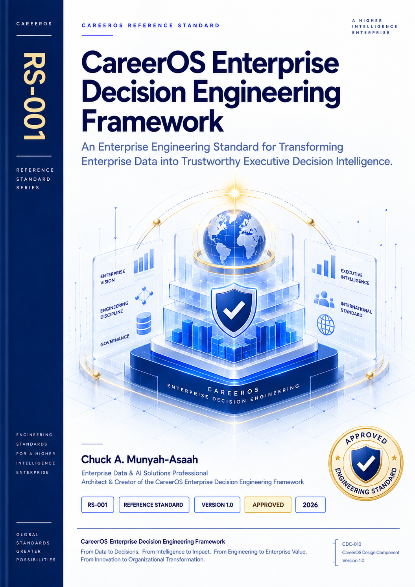
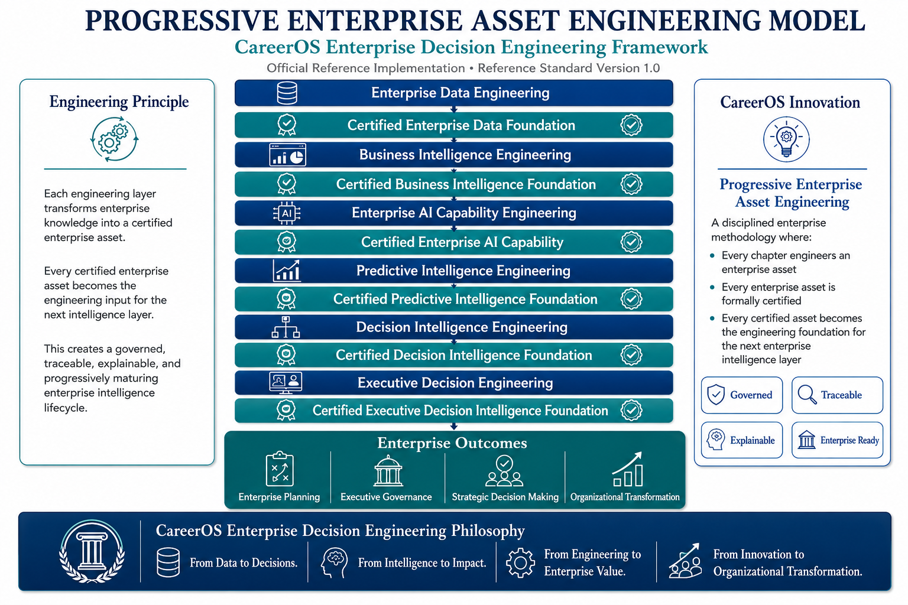
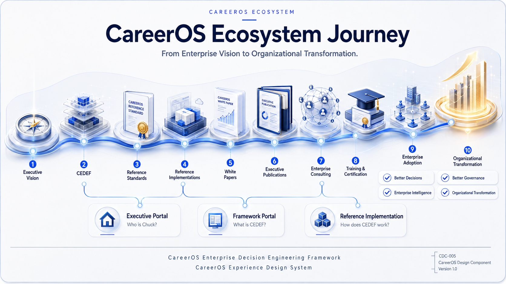

<!-- ========================================================= -->
<!-- PE-001 -->
<!-- CareerOS Publications -->
<!-- ========================================================= -->

# CareerOS Publications

---

# PE-001

# CareerOS Enterprise Decision Engineering Framework

## Preview Edition

### Version 1.0

### *Introducing a New Enterprise Engineering Discipline for Transforming Enterprise Intelligence into Trustworthy Executive Decisions*

---

**Author**

**Chuck A. Munyah-Asaah**

Enterprise Data, AI & Decision Intelligence Professional

Architect & Creator of the CareerOS Enterprise Decision Engineering Framework

---

**Publisher**

**CareerOS Publications**

2026

---

> **From Data to Decisions.**
>
> **From Intelligence to Impact.**
>
> **From Engineering to Enterprise Value.**
>
> **From Innovation to Organizational Transformation.**

---

**CareerOS Publications**

**Official Preview Edition**

**PE-001**

---

# Copyright

## Publication Information

| Attribute | Value |
|:-----------|:------|
| Publication Family | CareerOS Preview Edition |
| Publication Identifier | PE-001 |
| Publication Version | 1.0 |
| Publication Year | 2026 |
| Publisher | CareerOS Publications |

---

## Copyright

© 2026 Chuck A. Munyah-Asaah.

All rights reserved.

No part of this publication may be reproduced, distributed, translated, transmitted, stored in a retrieval system, or reproduced in any form or by any means without prior written permission from the copyright holder, except for brief quotations used for scholarly review, academic discussion, or professional citation.

---

## Publication Notice

This Preview Edition introduces the philosophy, architectural foundations, and defining innovations of the **CareerOS Enterprise Decision Engineering Framework (CEDEF).**

It has been intentionally prepared for executive leaders, enterprise architects, researchers, consultants, educators, and technology professionals seeking an executive introduction to Enterprise Decision Engineering.

Detailed engineering methodologies, implementation standards, governance specifications, Engineering Packages, certification procedures, and enterprise templates remain reserved for the complete **CareerOS Enterprise Decision Engineering Framework Reference Standard.**

Accordingly, this publication should be read as an executive introduction rather than an implementation manual.

---

## Citation

When referencing this publication, please cite:

**Chuck A. Munyah-Asaah**

*CareerOS Enterprise Decision Engineering Framework – Preview Edition.*

CareerOS Publications.

PE-001.

Version 1.0.

2026.

---

# How to Read This Preview Edition

## Introducing Enterprise Decision Engineering

Organizations have never possessed greater volumes of enterprise data.

Every day they generate operational, financial, healthcare, manufacturing, customer, and supply chain information at extraordinary scale.

At the same time, Business Intelligence, Artificial Intelligence, Machine Learning, Predictive Analytics, and Enterprise Analytics have dramatically expanded the ability to transform that information into analytical insight.

Yet one challenge remains remarkably consistent across industries.

> **How do organizations transform enterprise intelligence into trustworthy executive decisions?**

The CareerOS Enterprise Decision Engineering Framework was developed to address that challenge.

Rather than treating Enterprise Data Engineering, Business Intelligence, Enterprise Artificial Intelligence, Predictive Intelligence, Decision Intelligence, and Executive Decision Support as independent technical disciplines, the framework integrates them into a governed enterprise engineering lifecycle designed to improve organizational decision-making.

---

## Purpose

This Preview Edition has been designed with three objectives.

- Introduce the philosophy and motivation behind Enterprise Decision Engineering.
- Present the architectural foundations of the CareerOS Enterprise Decision Engineering Framework.
- Introduce the framework's defining innovation—**Progressive Enterprise Asset Engineering**—while intentionally reserving detailed implementation methodologies for the complete Reference Standard.

---

## What You Will Discover

Throughout this publication you will discover:

- The enterprise decision problem
- The motivation behind Enterprise Decision Engineering
- The architectural foundations of CEDEF
- The six enterprise capabilities
- The philosophy of Progressive Enterprise Asset Engineering
- The long-term CareerOS vision

---

## What Is Intentionally Reserved

To preserve the integrity of the complete Reference Standard, this Preview Edition intentionally excludes:

- Engineering Packages
- Engineering Procedures
- Governance Specifications
- Enterprise Templates
- Certification Standards
- Implementation Methodologies
- Engineering Checklists
- Reference Implementation Procedures

The objective is not to withhold knowledge.

The objective is to distinguish between an executive publication introducing a new discipline and the engineering standard governing its practical implementation.

---

# Acknowledgements

Although this publication represents a single volume, it reflects many years of professional experience, continuous learning, academic study, and thoughtful reflection across multiple disciplines.

The ideas presented throughout this Preview Edition have been shaped by experience in Enterprise Information Systems, Healthcare Information Systems, National Health Information Systems, Business Intelligence, Organizational Reporting, Enterprise Analytics, and Executive Decision Support.

I am grateful to the many organizations, colleagues, educators, researchers, mentors, students, and professionals whose collaboration, questions, and commitment to excellence continually challenged me to think more deeply about enterprise engineering and organizational decision-making.

I am especially grateful for the opportunity to pursue graduate studies in Business and Data Analytics, where academic rigor strengthened professional experience and encouraged the integration of enterprise information systems, analytics, artificial intelligence, and organizational leadership into a broader systems perspective.

Finally, I acknowledge that no engineering discipline develops in isolation.

Every meaningful contribution builds upon the work of those who dedicate themselves to advancing knowledge, improving organizations, and serving society through engineering, science, technology, education, and research.

It is my sincere hope that the CareerOS Enterprise Decision Engineering Framework contributes, in its own way, to that continuing tradition.

---

# Navigation

🏠 <a href="#executive-foreword">Foreword</a> •
📖 <a href="#executive-summary">Summary</a> •
🏛️ <a href="#part-i">Foundations</a> •
🏗️ <a href="#part-ii">Framework</a> •
🚀 <a href="#part-iii">Innovation</a> •
🌍 <a href="#part-iv">Vision</a> •
🎯 <a href="#continue-the-journey">Journey</a> •
👤 <a href="#about-the-author">Author</a>

---

## Front Matter

- [Executive Foreword](#executive-foreword)
- [Executive Summary](#executive-summary)

---

## Part I — Enterprise Decision Engineering Foundations

- [The Enterprise Decision Problem](#the-enterprise-decision-problem)
- [Why Existing Enterprise Analytics Is No Longer Enough](#why-existing-enterprise-analytics-is-no-longer-enough)
- [The Emergence of Enterprise Decision Engineering](#the-emergence-of-enterprise-decision-engineering)

---

## Part II — The CareerOS Enterprise Decision Engineering Framework

- [Enterprise Decision Intelligence Journey (SV-001)](#enterprise-decision-intelligence-journey)
- [Enterprise Decision Engineering Architecture (SV-002)](#the-careeros-enterprise-decision-engineering-framework)
- [Enterprise Data Engineering](#enterprise-data-engineering)
- [Business Intelligence Engineering](#business-intelligence-engineering)
- [Enterprise AI Capability Engineering](#enterprise-ai-capability-engineering)
- [Predictive Intelligence Engineering](#predictive-intelligence-engineering)
- [Decision Intelligence Engineering](#decision-intelligence-engineering)
- [Executive Decision Engineering](#executive-decision-engineering)

---

## Part III — The Defining Innovation

- [Progressive Enterprise Asset Engineering (SV-004)](#progressive-enterprise-asset-engineering)
- [Beyond Project Thinking](#beyond-project-thinking)
- [Certified Enterprise Assets](#certified-enterprise-assets)
- [Enterprise Learning as an Engineering Outcome](#enterprise-learning-as-an-engineering-outcome)

---

## Part IV — Enterprise Vision

- [Beyond the Reference Standard](#beyond-the-reference-standard)
- [An Integrated Enterprise Ecosystem](#an-integrated-enterprise-ecosystem)
- [CareerOS Enterprise Value Journey (SV-005)](#from-vision-to-enterprise-value)
- [Enterprise Decision Engineering Across Industries](#enterprise-decision-engineering-across-industries)
- [Continue the Journey](#continue-the-journey)

---

## Closing

- [About CareerOS](#about-careeros)
- [About the Author](#about-the-author)
- [Closing Reflection](#closing-reflection)

---

# Executive Foreword

## The Beginning of a New Enterprise Engineering Discipline

Every generation of enterprise technology has solved a different organizational problem.

Database systems preserved information.

Enterprise Resource Planning integrated business operations.

Business Intelligence transformed reporting into organizational insight.

Artificial Intelligence expanded our ability to recognize patterns, generate predictions, and automate increasingly complex analytical tasks.

Each advancement fundamentally changed the way organizations operate.

Yet one question has remained remarkably constant.

> **How do organizations transform enterprise intelligence into executive decisions that can be trusted?**

Despite decades of investment in enterprise systems, analytics, dashboards, predictive models, and Artificial Intelligence, many organizations continue to face the same challenge.

They possess more information than ever before, yet decision-makers still struggle to determine which insights deserve confidence, which recommendations should be adopted, and which actions will create sustainable organizational value.

The challenge is no longer collecting enterprise data.

Nor is it producing analytical insight.

The challenge is transforming enterprise intelligence into trustworthy executive decision-making.

This observation became the foundation of the CareerOS Enterprise Decision Engineering Framework.

---

Throughout my career in Enterprise Information Systems, Healthcare Information Systems, National Health Information Systems, Business Intelligence, Executive Reporting, and Organizational Decision Support, I repeatedly observed the same pattern.

Organizations continually improved their analytical capabilities.

They invested in better data.

Better reporting.

Better analytics.

Better Artificial Intelligence.

Yet these investments did not always produce better executive decisions.

Analytical excellence and decision excellence are related.

They are not the same.

Recognizing that distinction ultimately led to the development of Enterprise Decision Engineering.

---

The CareerOS Enterprise Decision Engineering Framework introduces a different perspective.

Rather than treating Enterprise Data Engineering, Business Intelligence, Artificial Intelligence, Predictive Intelligence, Decision Intelligence, and Executive Decision Support as independent technical disciplines, the framework integrates them into a unified enterprise engineering capability whose purpose is simple:

**better organizational decisions.**

Within this perspective, enterprise intelligence is not the destination.

Trustworthy executive decision intelligence is.

---

This Preview Edition introduces the philosophy, architecture, vision, and defining innovation of Enterprise Decision Engineering while intentionally reserving the detailed engineering methodologies, governance models, Engineering Packages, certification procedures, and implementation standards for the complete CareerOS Reference Standard.

Its purpose is not to teach implementation.

Its purpose is to introduce a new way of thinking about enterprise intelligence.

---

Every enduring engineering discipline begins with a question.

Enterprise Decision Engineering begins with this one.

> **How do we systematically engineer enterprise intelligence into executive decisions that organizations can trust?**

The pages that follow represent one contribution toward answering that question.

**I invite you to explore the discipline, challenge its ideas, and participate in its continued evolution.**

**Welcome to Enterprise Decision Engineering.**

---

**Chuck A. Munyah-Asaah**

Author

CareerOS Enterprise Decision Engineering Framework

---

# Executive Summary

## Transforming Enterprise Intelligence into Trustworthy Executive Decisions

Modern organizations operate in an era of unprecedented information abundance.

Every business transaction, healthcare encounter, customer interaction, financial operation, manufacturing process, and digital service continuously generates enterprise data at extraordinary scale.

At the same time, Business Intelligence, Artificial Intelligence, Machine Learning, and Predictive Analytics have dramatically expanded our ability to transform that data into analytical insight.

Yet one enterprise challenge persists.

Organizations have become exceptionally proficient at producing information.

They have not advanced at the same pace in engineering better decisions.

This distinction defines the challenge the CareerOS Enterprise Decision Engineering Framework has been developed to address.

---

## Beyond Analytics

For decades, enterprise analytics has focused on answering essential business questions.

- What happened?
- Why did it happen?
- What is happening now?
- What is likely to happen next?

These questions remain fundamental to every modern enterprise.

Executive leadership, however, must answer a different set of questions.

- What decision should we make?
- Why should we trust this recommendation?
- How does this decision support organizational strategy?
- What enterprise evidence justifies this course of action?

These questions extend beyond analytics.

They require a disciplined engineering approach capable of transforming enterprise intelligence into trustworthy executive decision support.

**This Preview Edition introduces that discipline.**

---

## Introducing Enterprise Decision Engineering

Enterprise Decision Engineering is a governed enterprise engineering discipline that systematically transforms enterprise data into trustworthy executive decision intelligence.

Rather than treating Enterprise Data Engineering, Business Intelligence, Enterprise AI Capability Engineering, Predictive Intelligence Engineering, Decision Intelligence Engineering, and Executive Decision Engineering as isolated technical capabilities, the framework integrates them into a unified enterprise engineering lifecycle.

Every capability contributes toward a single objective:

**improving organizational decision-making.**

Enterprise intelligence therefore becomes a continuously maturing enterprise capability rather than a collection of disconnected analytical outputs.

---

## Progressive Enterprise Asset Engineering

One of the defining innovations introduced by the framework is **Progressive Enterprise Asset Engineering**.

Traditional analytical initiatives often conclude with project deliverables.

Enterprise Decision Engineering adopts a different philosophy.

Every engineering activity produces reusable enterprise assets that continue strengthening the organization long after the original project has ended.

Knowledge accumulates.

Engineering maturity increases.

Organizational intelligence expands.

Decision confidence improves.

Rather than repeatedly solving similar problems from the beginning, organizations progressively build a governed enterprise knowledge ecosystem capable of supporting increasingly sophisticated executive decision-making.

This progressive engineering philosophy represents one of the framework's principal contributions.

---

## Designed for Enterprise Adoption

Although the first public reference implementation demonstrates Enterprise Decision Engineering through retail demand forecasting and inventory optimization, the framework has intentionally been designed as an enterprise discipline rather than an industry-specific solution.

Its engineering principles remain applicable across diverse domains, including:

- Healthcare Decision Intelligence
- Government Decision Intelligence
- Banking Decision Intelligence
- Manufacturing Decision Intelligence
- Supply Chain Decision Intelligence
- Education Decision Intelligence
- Energy Decision Intelligence
- Public Sector Decision Intelligence

Industries differ.

The engineering principles remain consistent.

---

## Purpose of This Preview Edition

This Preview Edition introduces the conceptual foundations of Enterprise Decision Engineering.

It explains the motivation behind the framework, presents its architectural foundations, introduces its defining innovation, and outlines the broader CareerOS vision.

It does not attempt to provide implementation guidance.

Detailed Engineering Packages, governance models, implementation standards, certification procedures, engineering templates, and enterprise methodologies remain reserved for the complete CareerOS Reference Standard.

Its purpose is not to explain every engineering detail.

Its purpose is to introduce a new enterprise engineering discipline.

---

## An Invitation

Every enduring engineering discipline begins with a different way of thinking.

Enterprise Decision Engineering proposes one such shift.

Organizations should evaluate the success of enterprise intelligence not solely by the sophistication of analytical technologies, but by the quality of the executive decisions those technologies ultimately enable.

If this publication encourages enterprise leaders, architects, researchers, consultants, and educators to reconsider the relationship between enterprise intelligence and organizational decision-making, then it will have achieved its purpose.

The conversation begins here.

The engineering journey continues in the complete CareerOS Enterprise Decision Engineering Framework Reference Standard.

---

### Executive Takeaway

> **Enterprise intelligence achieves its highest value only when it consistently enables better executive decisions.**

# Part II

# The CareerOS Enterprise Decision Engineering Framework

> *"Architecture is not merely the organization of technology. It is the deliberate organization of enterprise capability."*

---

# From Enterprise Intelligence to Enterprise Decisions

Every mature engineering discipline is defined by its architecture.

Architecture provides structure.

Structure creates consistency.

Consistency enables governance.

Governance builds confidence.

The CareerOS Enterprise Decision Engineering Framework follows this same engineering philosophy.

Rather than organizing Enterprise Data Engineering, Business Intelligence, Artificial Intelligence, Predictive Analytics, and Executive Decision Support as independent technology domains, the framework integrates them into a unified enterprise architecture whose singular purpose is to improve organizational decision-making.

It is therefore far more than a technology stack.

It is an enterprise capability model.

---

## The Enterprise Decision Intelligence Journey

Before examining the architecture of the framework, it is useful to understand the journey it was designed to support.

Enterprise Decision Engineering views enterprise intelligence not as a collection of isolated analytical activities, but as a progressive transformation of enterprise knowledge into trustworthy executive decision intelligence.

Every capability builds upon the one before it.

Every engineering activity contributes to organizational maturity.

Every stage advances the enterprise toward better executive decisions.

This progression is illustrated through the **Enterprise Decision Intelligence Journey**, the first Signature Visual of the CareerOS Enterprise Decision Engineering Framework.

**Signature Visual SV-001**

*Enterprise Decision Intelligence Journey*

*Illustrates the progressive transformation of enterprise data into trustworthy executive decision intelligence through the CareerOS Enterprise Decision Engineering Framework.*

---

The Enterprise Decision Intelligence Journey explains **what** the framework accomplishes.

The Enterprise Decision Engineering Architecture explains **how** it is organized.

Together they establish the conceptual foundation of Enterprise Decision Engineering.

**Signature Visual SV-002**

*Enterprise Decision Engineering Architecture*

*Illustrates the six integrated enterprise capabilities that progressively transform enterprise intelligence into trustworthy executive decision-making.*

---

## A Unified Enterprise Architecture

The CareerOS Enterprise Decision Engineering Framework is organized around six complementary enterprise capabilities.

Each capability performs a distinct engineering responsibility.

Each strengthens the next.

Together they create a progressive enterprise intelligence ecosystem capable of supporting trustworthy executive decision-making.

The six enterprise capabilities are:

1. Enterprise Data Engineering
2. Business Intelligence Engineering
3. Enterprise AI Capability Engineering
4. Predictive Intelligence Engineering
5. Decision Intelligence Engineering
6. Executive Decision Engineering

Although presented sequentially, these capabilities should not be interpreted as isolated implementation phases.

They operate continuously, reinforcing one another as enterprise intelligence matures.

---

## A Unified Enterprise Architecture

The CareerOS Enterprise Decision Engineering Framework is organized around six complementary enterprise capabilities.

Each capability performs a distinct engineering responsibility.

Each strengthens the next.

Together they create a progressive enterprise intelligence ecosystem capable of supporting trustworthy executive decision-making.

The six enterprise capabilities are:

1. Enterprise Data Engineering
2. Business Intelligence Engineering
3. Enterprise AI Capability Engineering
4. Predictive Intelligence Engineering
5. Decision Intelligence Engineering
6. Executive Decision Engineering

Although presented sequentially, these capabilities should not be interpreted as isolated implementation phases.

They operate continuously, reinforcing one another as enterprise intelligence matures.

---

## Enterprise Capability 1

### Enterprise Data Engineering

Every engineering discipline begins with a trustworthy foundation.

Within Enterprise Decision Engineering, that foundation is enterprise data.

Enterprise Data Engineering transforms fragmented operational information into governed, reliable, consistent, and reusable enterprise assets.

Its responsibilities include:

- Data acquisition
- Data integration
- Data quality management
- Data standardization
- Data governance
- Enterprise data preparation

Without trusted enterprise data, every subsequent engineering activity inherits uncertainty.

Enterprise Data Engineering therefore establishes the confidence upon which the remainder of the framework depends.

---

## Enterprise Capability 2

### Business Intelligence Engineering

Once enterprise information has been governed and prepared, organizations require mechanisms for understanding operational performance.

Business Intelligence Engineering transforms enterprise data into meaningful organizational insight.

Dashboards, executive reports, analytical models, and performance indicators improve enterprise visibility while helping decision-makers understand current organizational conditions.

Business Intelligence answers one of the most important executive questions.

> **What is happening within the enterprise?**

Understanding the present, however, is only the beginning.

Organizations must also anticipate the future.

---

## Enterprise Capability 3

### Enterprise AI Capability Engineering

Artificial Intelligence represents one of the most powerful analytical capabilities available to modern organizations.

Within Enterprise Decision Engineering, however, AI is not viewed simply as a technology.

It is engineered as an enterprise capability.

Enterprise AI Capability Engineering focuses on designing AI solutions that operate within enterprise governance while supporting broader organizational objectives.

Rather than asking:

> *How can Artificial Intelligence solve this problem?*

Enterprise Decision Engineering asks:

> **How should Artificial Intelligence strengthen enterprise decision-making?**

This subtle shift transforms AI from an experimental technology into a governed organizational capability.

---

## Enterprise Capability 4

### Predictive Intelligence Engineering

Understanding the present is valuable.

Anticipating the future is transformative.

Predictive Intelligence Engineering estimates future organizational conditions using historical evidence, statistical reasoning, machine learning, and predictive modeling.

Its objective is not prediction for its own sake.

Its objective is reducing uncertainty before important organizational decisions are made.

Predictive Intelligence strengthens executive preparedness.

It does not replace executive judgment.

---

## Enterprise Capability 5

### Decision Intelligence Engineering

Decision Intelligence represents the point at which enterprise knowledge begins to transition from analytical understanding to organizational action.

This capability integrates:

- Enterprise evidence
- Predictive insight
- Governance
- Organizational priorities
- Business context

to produce meaningful decision recommendations.

Decision Intelligence bridges the gap between analytical capability and executive leadership.

It transforms enterprise intelligence into information that decision-makers can confidently evaluate.

---

## Enterprise Capability 6

### Executive Decision Engineering

Executive Decision Engineering represents the culmination of the framework.

Its responsibility is ensuring that enterprise intelligence ultimately contributes to informed organizational action.

Executive Decision Engineering emphasizes:

- Governance
- Explainability
- Organizational accountability
- Executive confidence
- Sustainable enterprise value

Within the CareerOS Enterprise Decision Engineering Framework, executive decisions become the principal measure of enterprise intelligence success.

The destination is therefore not Artificial Intelligence.

The destination is trustworthy executive decision-making.

---

## A Continuously Maturing Enterprise Capability

The six enterprise capabilities should never be viewed in isolation.

They function as an integrated engineering system.

Each contributes organizational knowledge.

Each strengthens the next.

Each completed engineering effort expands enterprise maturity.

Enterprise Decision Engineering therefore evolves continuously rather than progressing through disconnected analytical projects.

With every completed engineering initiative, the organization becomes:

- More capable
- More resilient
- Better governed
- Better prepared to make trustworthy executive decisions

Enterprise intelligence matures.

Enterprise capability expands.

Organizational confidence grows.

---

### Executive Takeaway

> **The CareerOS Enterprise Decision Engineering Framework integrates six enterprise capabilities into a governed architecture that systematically transforms enterprise intelligence into trustworthy executive decision-making and sustainable enterprise value.**

# Part III

# The Defining Innovation

> *"Engineering reaches its highest level of maturity when every completed activity strengthens the next."*

---

# Progressive Enterprise Asset Engineering

Every enduring engineering discipline is remembered for a defining idea.

Civil Engineering standardized structural design.

Software Engineering introduced disciplined software development.

Systems Engineering integrated increasingly complex systems.

Enterprise Architecture aligned technology with organizational strategy.

The CareerOS Enterprise Decision Engineering Framework contributes a different idea.

It is called **Progressive Enterprise Asset Engineering.**

It is an engineering philosophy.

A philosophy that transforms enterprise intelligence from a sequence of analytical activities into a continuously expanding organizational capability.

---

**Signature Visual SV-004**

*Progressive Enterprise Asset Engineering*

---

## Beyond Project Thinking

Traditional analytical initiatives are typically organized as projects.

A problem is identified.

A team is assembled.

Data is collected.

Analyses are performed.

Models are developed.

Reports are delivered.

The project concludes.

Although these initiatives often produce valuable outcomes, much of the engineering knowledge they create remains isolated within the project itself.

Future initiatives frequently repeat the same engineering activities.

Knowledge is recreated.

Processes are rediscovered.

Lessons are relearned.

Enterprise Decision Engineering proposes a different philosophy.

Projects may conclude.

Enterprise capability should not.

Every engineering effort should permanently strengthen the organization.

---

## Every Engineering Activity Creates an Enterprise Asset

Progressive Enterprise Asset Engineering begins with a simple engineering principle.

Every completed engineering activity should produce a reusable enterprise asset.

These assets extend well beyond datasets and reports.

They include:

- Governed enterprise datasets
- Enterprise semantic models
- Reusable analytical models
- Enterprise AI capabilities
- Predictive intelligence assets
- Decision intelligence models
- Governance artifacts
- Executive decision knowledge

Each asset becomes part of the organization's permanent engineering capability.

Nothing of value is discarded.

Knowledge accumulates.

Capability expands.

Enterprise maturity accelerates.

---

## Engineering That Progressively Matures

The word **progressive** is deliberate.

Enterprise intelligence is not expected to emerge from a single analytical initiative.

It develops through continuous accumulation.

Every completed engineering activity increases organizational maturity.

Every certified enterprise asset expands enterprise capability.

Every subsequent engineering initiative begins from a stronger foundation than the one before it.

Instead of repeatedly solving familiar problems, organizations continuously strengthen the sophistication of their enterprise intelligence ecosystem.

Enterprise engineering therefore becomes cumulative.

Not repetitive.

---

## Certified Enterprise Assets

Within the CareerOS Enterprise Decision Engineering Framework, enterprise assets are not merely created.

They are certified.

Certification should not be interpreted as bureaucracy.

It represents organizational confidence.

Before becoming part of the enterprise intelligence ecosystem, engineering outputs satisfy defined standards for:

- Quality
- Governance
- Consistency
- Traceability
- Organizational readiness

Once certified, these assets become trusted organizational resources capable of supporting future engineering initiatives with confidence.

This approach reduces duplication, strengthens governance, and preserves institutional knowledge.

---

## From Deliverables to Enterprise Capability

One of the most significant shifts introduced by Progressive Enterprise Asset Engineering is the movement away from temporary project deliverables.

Traditional projects often conclude with:

- Reports
- Dashboards
- Predictive models
- Presentations

Enterprise Decision Engineering asks a different question.

> **What permanent enterprise capability has been created?**

This question fundamentally changes how engineering success is evaluated.

Success is no longer measured solely by what has been delivered.

It is measured by what the organization has permanently become capable of achieving.

---

## Enterprise Learning as an Engineering Outcome

Every completed engineering initiative should leave the organization stronger than it was before.

Enterprise knowledge expands.

Engineering standards mature.

Governance improves.

Confidence increases.

Future engineering becomes faster, more consistent, and more reliable.

Progressive Enterprise Asset Engineering transforms organizational learning from an unintended by-product into a deliberate engineering outcome.

The enterprise itself becomes progressively more intelligent.

---

## Why This Matters

Analytical technologies will continue to evolve.

Artificial Intelligence will continue to mature.

Software platforms will change.

Programming languages will come and go.

Organizations, however, will always depend upon trusted institutional knowledge and disciplined executive judgment.

That knowledge becomes an enduring competitive advantage.

Progressive Enterprise Asset Engineering has therefore been designed not merely to improve today's projects, but to strengthen tomorrow's enterprise.

Every engineering investment should continue generating organizational value long after implementation has been completed.

---

### Executive Takeaway

> **Progressive Enterprise Asset Engineering transforms enterprise intelligence from isolated analytical projects into a continuously expanding ecosystem of governed enterprise assets that continuously strengthen organizational capability, executive confidence, and long-term enterprise value.**

# Part IV

# Enterprise Vision

> *"The true measure of an engineering discipline is not the problems it solves today, but the capabilities it enables tomorrow."*

---

# Beyond the Reference Standard

The CareerOS Enterprise Decision Engineering Framework was never intended to be a single publication or a standalone methodology.

From its inception, it was envisioned as the foundation of a broader enterprise engineering discipline capable of supporting research, professional practice, executive leadership, education, intelligent software, consulting, and organizational transformation.

Frameworks provide structure.

Methodologies provide guidance.

Standards provide discipline.

Lasting impact, however, is achieved only when knowledge becomes part of an evolving ecosystem.

Enterprise Decision Engineering should therefore be understood not as the conclusion of a research effort, but as the beginning of a continuing engineering journey.

---

## An Integrated Enterprise Ecosystem

Enterprise Decision Engineering extends beyond architecture.

It extends beyond methodology.

It extends beyond implementation.

The long-term CareerOS vision is an integrated ecosystem in which research, engineering, publications, software, education, and enterprise implementation continuously reinforce one another.

This ecosystem includes:

- Enterprise Reference Standards
- Executive White Papers
- Preview Editions
- Industry Reference Implementations
- Executive Education
- Professional Consulting
- Enterprise Software
- Research Publications
- Signature Visual Assets
- Professional Certification

Each component serves a distinct purpose.

Together they contribute to the continued growth and maturation of Enterprise Decision Engineering as a professional discipline.

---

**Signature Visual SV-005**

*CareerOS Enterprise Value Journey*

Illustrates the long-term CareerOS ecosystem from executive vision to organizational transformation.

---

## From Vision to Enterprise Value

The CareerOS Enterprise Value Journey illustrates the progression envisioned for Enterprise Decision Engineering.

Every transformation begins with vision.

Vision establishes direction.

Direction inspires engineering.

Engineering creates enterprise capability.

Enterprise capability enables organizational adoption.

Organizational adoption creates measurable enterprise value.

Ultimately, Enterprise Decision Engineering is not concerned merely with improving technology.

Its purpose is to strengthen organizations.

Every publication, engineering activity, implementation, and reference standard should therefore contribute toward one enduring objective:

> **Creating organizations capable of making consistently better decisions.**

---

## Enterprise Decision Engineering Across Industries

Although the first public reference implementation demonstrates Enterprise Decision Engineering through retail demand forecasting and inventory optimization, the framework has intentionally been designed as an enterprise discipline rather than an industry-specific solution.

Its engineering principles remain applicable wherever organizations depend upon complex decisions supported by enterprise intelligence.

Potential application domains include:

- Healthcare Decision Intelligence
- Government Decision Intelligence
- Banking Decision Intelligence
- Insurance Decision Intelligence
- Manufacturing Decision Intelligence
- Supply Chain Decision Intelligence
- Energy Decision Intelligence
- Education Decision Intelligence
- Public Health Decision Intelligence

Industries differ.

Engineering principles endure.

---

## A Living Body of Knowledge

Enterprise Decision Engineering is expected to evolve.

New technologies will emerge.

Artificial Intelligence will continue to mature.

Decision support systems will become increasingly sophisticated.

Organizational challenges will continue to change.

The discipline must therefore remain adaptable while preserving its foundational engineering principles.

CareerOS has been established with this long-term perspective.

Future Reference Standards, Executive White Papers, Research Notes, Executive Guides, educational resources, and industry reference implementations will progressively expand the Enterprise Decision Engineering body of knowledge.

The discipline should grow.

The principles should endure.

---

## A Contribution Rather Than a Conclusion

No engineering discipline is created by a single publication.

Nor is it established by a single framework.

Disciplines mature through continuous research, practical implementation, constructive critique, and collaboration among practitioners.

This Preview Edition should therefore be understood as a contribution to an ongoing conversation about the future of enterprise intelligence and executive decision-making.

It is an invitation to explore.

An invitation to improve.

Most importantly, it is an invitation to participate in the continued evolution of Enterprise Decision Engineering.

---

## Continue the Journey

This Preview Edition introduces the philosophy and foundations of **Enterprise Decision Engineering**.

The complete **CareerOS Enterprise Decision Engineering Framework Reference Standard** expands every concept introduced in this publication through comprehensive engineering methodologies, governance models, implementation guidance, certification standards, and practical enterprise reference implementations.

The CareerOS ecosystem has been designed to support every stage of that journey—from understanding the discipline to applying it in real-world organizations.

Explore the resources below to continue your journey.

---

### 🏛 CareerOS Framework Portal

Explore the official **CareerOS Enterprise Decision Engineering Framework**, including its philosophy, architecture, signature innovations, and supporting engineering principles.

**Recommended for:**

- Enterprise Architects
- Technology Leaders
- Executive Decision Makers
- Researchers

---

### 📄 Executive White Papers

Read concise executive publications exploring key concepts such as:

- Enterprise Decision Engineering
- Decision Intelligence
- Enterprise AI Governance
- Progressive Enterprise Asset Engineering
- Executive Decision Support

Designed for executives seeking strategic insight without the depth of the complete Reference Standard.

---

### 🛍 Reference Implementations

Experience Enterprise Decision Engineering through practical implementations demonstrating how the framework can be applied to real organizational challenges.

Each implementation illustrates the transition from enterprise intelligence to measurable business value.

---

### 📚 Reference Standards

Explore the official CareerOS engineering standards library.

These publications provide comprehensive engineering guidance, implementation methodologies, governance models, engineering packages, templates, certification procedures, and reference architectures.

---

### 💼 Executive Portal

Learn more about the CareerOS vision, research initiatives, publications, consulting services, educational programs, and long-term roadmap for advancing Enterprise Decision Engineering as a professional discipline.

---

> **Enterprise Decision Engineering is more than a framework.**
>
> **It is a growing body of knowledge, a professional discipline, and a continuing journey toward better organizational decision-making.**

---

## Looking Forward

Every enduring engineering discipline begins with a simple idea.

Ideas become methodologies.

Methodologies become standards.

Standards become professional practice.

Professional practice transforms organizations.

Enterprise Decision Engineering begins with an equally simple proposition.

> **Organizations create their greatest value not by producing more information, but by consistently making better decisions.**

Everything within the CareerOS Enterprise Decision Engineering Framework has been developed in service of that principle.

The journey has only begun.

---

### Executive Takeaway

> **Enterprise Decision Engineering establishes a long-term engineering discipline dedicated to transforming enterprise intelligence into trustworthy executive decision-making that strengthens organizations and creates sustainable enterprise value.**

---

# About CareerOS

CareerOS is the official enterprise engineering ecosystem supporting the continued development, publication, implementation, and advancement of Enterprise Decision Engineering.

Its mission is to help organizations transform enterprise intelligence into trustworthy executive decision intelligence through disciplined engineering, enterprise governance, applied research, intelligent software, executive education, and professional consulting.

CareerOS supports this mission through a growing ecosystem of:

- Reference Standards
- Executive White Papers
- Preview Editions
- Industry Reference Implementations
- Signature Visual Assets
- Enterprise Software
- Educational Resources
- Executive Consulting

The initiative is founded upon one enduring belief:

> **Enterprise intelligence achieves its highest value when it consistently improves executive decision-making.**

---

# About the Author

**Chuck A. Munyah-Asaah** is an Enterprise Data, AI & Decision Intelligence Professional whose career spans Enterprise Information Systems, Healthcare Information Systems, National Health Information Systems, Business Intelligence, Enterprise Reporting, Organizational Decision Support, Digital Transformation, and Enterprise Analytics.

He is the architect and creator of the **CareerOS Enterprise Decision Engineering Framework (CEDEF)**, a multidisciplinary enterprise engineering framework developed to transform enterprise intelligence into trustworthy executive decision intelligence.

His professional interests include:

- Enterprise AI
- Decision Intelligence
- Enterprise Architecture
- Healthcare Analytics
- Business Intelligence
- Executive Decision Support
- Organizational Transformation
- Enterprise Governance
- Research
- Executive Education

Through CareerOS, he continues to develop enterprise methodologies, publications, standards, reference implementations, educational resources, and executive thought leadership dedicated to advancing Enterprise Decision Engineering as an emerging professional discipline.

---

# Closing Reflection

Every generation inherits opportunities that previous generations could scarcely imagine.

Our generation has inherited unprecedented computational capability, extraordinary quantities of enterprise information, and increasingly powerful Artificial Intelligence.

These advances are remarkable.

Technology alone, however, has never guaranteed better organizations.

Organizations improve because people make better decisions.

Enterprise Decision Engineering begins with that simple observation.

New technologies will continue to emerge.

Artificial Intelligence will continue to evolve.

Platforms will change.

Engineering principles will endure.

Organizations will always depend upon trustworthy executive decisions.

That enduring requirement remains the foundation of Enterprise Decision Engineering.

If this publication encourages readers to think differently about the relationship between enterprise intelligence and executive leadership, then it has fulfilled its purpose.

This Preview Edition opens the door.

The discipline itself is only beginning.

---

> **The future of Enterprise Intelligence will not be defined by the amount of data organizations possess.**

> **It will be defined by the quality of the decisions they are able to make because of it.**

---

> **From Data to Decisions.**

> **From Intelligence to Impact.**

> **From Engineering to Enterprise Value.**

> **From Innovation to Organizational Transformation.**

---

**Chuck A. Munyah-Asaah**

Founder, CareerOS

Architect of the CareerOS Enterprise Decision Engineering Framework

2026
